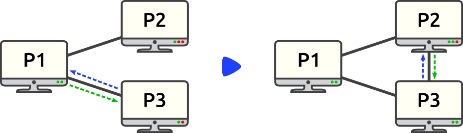
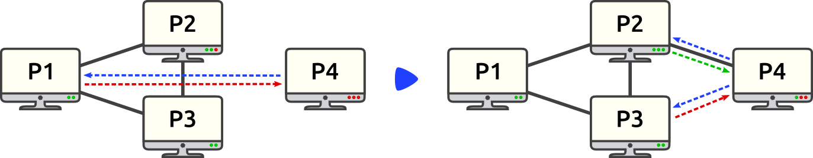
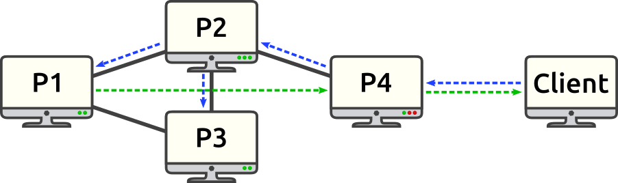

#  Peer to Peer Search

```console
$ cd p1/
$ node peer.js -n 2
This peer address is 127.0.0.1:23077 located at p1
Peer2PeerDB server is started at timestamp: 284 and is listening on 127.0.0.1:20276
```
<p align="center">
  
</p>


```console
$ cd p2/
$ node peer.js -p 127.0.0.1:23077 -n 3
This peer address is 127.0.0.1:37581 located at p2
Peer2PeerDB server is started at timestamp: 624 and is listening on 127.0.0.1:11399
```
<p align="center">
  
</p>

```console
Connected to peer p1:23077 at timestamp: 625
Received ack from p1:23077
  which is peered with: 127.0.0.1:37581
```

```console
Connected from peer 127.0.0.1:37581
```


```console
$ cd p3/
$ node peer.js -p 127.0.0.1:23077 -n 2
This peer address is 127.0.0.1:38448 located at p3
Peer2PeerDB server is started at timestamp: 670 and is listening on 127.0.0.1:41846
```
<p align="center">
  
</p>

```console
Connected to peer p1:23077 at timestamp: 671
Received ack from p1:23077
  which is peered with: 127.0.0.1:37581
  which is peered with: 127.0.0.1:38448

Connected to peer p2:37581 at timestamp: 769
Received ack from p2:37581
  which is peered with: 127.0.0.1:23077
  which is peered with: 127.0.0.1:38448
```

```console
Connected from peer 127.0.0.1:38448
```


```console
Connected from peer 127.0.0.1:38448
```


```console
$ cd p4/
$ node peer.js -p 127.0.0.1:23077 -n 3
This peer address is 127.0.0.1:8180 located at p4
Peer2PeerDB server is started at timestamp: 871 and is listening on 127.0.0.1:35205
```
<p align="center">
  
</p>


```console
Received ack from p1:23077
  which is peered with: 127.0.0.1:37581
  which is peered with: 127.0.0.1:38448
Join redirected, try to connect to the peer above.

Connected to peer p2:37581 at timestamp: 970
Received ack from p2:37581
  which is peered with: 127.0.0.1:23077
  which is peered with: 127.0.0.1:38448
  which is peered with: 127.0.0.1:8180
Received ack from p3:38448
  which is peered with: 127.0.0.1:23077
  which is peered with: 127.0.0.1:37581
Join redirected, try to connect to the peer above.
```

```console
Peer table full: 127.0.0.1:40418 redirected
```


```console
Connected from peer 127.0.0.1:8180
```


```console
Peer table full: 127.0.0.1:44222 redirected
```


```console
$ node GetImage.js -s 127.0.0.1:35205 -q lamborghini.jpg
Connected to ImageDB server on: 127.0.0.1:35205
```
<p align="center">
  
</p>


```console
Server sent: 

    --ITP version = 3314
    --Response Type = 1
    --Sequence Number = 876
    --Timestamp = 720882
    --Image size = 17152

Disconnected from the server
Connection closed
```

```console
Client-511186 is connected at timestamp: 511186

Client-511186 requests:
    --ITP version: 3314
    --Request type: 0
    --Image file name: 'lamborghini.jpg'

lamborghini.jpg not found! Searching in P2P network...
```

```console
 lamborghini.jpg not found! Searching in P2P network...
```

```console
 lamborghini.jpg not found! Searching in P2P network...
```

```console
 lamborghini.jpg found! Sending to 127.0.0.1:35205
```


```console
File found in P2P network!
Sending lamborghini.jpg to Client-511186...
```